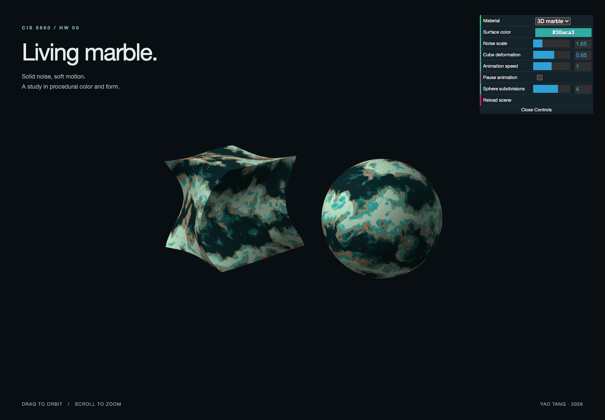

# HW 00 — Living Marble

**Yao Tang · CIS 5660**

**Live demo:** [yaotang23.github.io/hw00-intro-base](https://yaotang23.github.io/hw00-intro-base/)

A WebGL 2 study of procedural materials and animated geometry. A subdivided cube twists and ripples next to an icosphere, with turquoise stone, pale mineral bands, and copper-colored veins generated entirely in GLSL.



## Run locally

Use Node.js 24 LTS (the version used by the existing GitHub workflow).

```sh
npm ci
npm run dev -- --port 5662
```

Open **http://localhost:5662**. Drag the scene to orbit the camera; scroll to zoom. The default port without the extra argument is 5660.

```sh
npm run build     # TypeScript check and production build
npm run preview   # Serve the production build
```

## Implementation

- **Cube geometry:** [`Cube.ts`](src/geometry/Cube.ts) extends `Drawable`. Six independently indexed faces use outward normals, counterclockwise triangles, and 24 × 24 quads per face. Subdivision makes the curved deformation visible across each face.
- **Color control:** the dat.GUI **Surface color** picker updates `u_Color` on each draw. Select **Lambert** to inspect the original lighting model with the chosen color; select **3D marble** for the custom material.
- **3D noise:** [`noise-frag.glsl`](src/shaders/noise-frag.glsl) implements gradient Perlin noise over all eight corners of a 3D lattice cell, with quintic interpolation. Five octaves form FBM; domain warping and sine bands turn that FBM into marble. The input is object-space `xyz`, so the material stays continuous across the cube's faces and follows its deformation.
- **Vertex animation:** [`deform-vert.glsl`](src/shaders/deform-vert.glsl) uses time-dependent sine and cosine functions for a height-dependent twist, varying width, and vertical ripples. TypeScript accumulates elapsed seconds and uploads `u_Time` every frame. Tangent derivatives of the deformation reconstruct the surface normal for correct lighting.
- **Scene controls:** noise scale, cube deformation, animation speed, pause, sphere subdivisions, and scene reload. The sphere stays undeformed as a material reference. Lambert mode displays both original shapes without deformation.

Changing sphere subdivisions or reloading the scene releases the previous GPU buffers. The canvas follows window size and pixel density; the camera uses a field of view in radians.

## References

- [Original assignment and submission instructions](ASSIGNMENT.md)
- Course starter code: `Drawable`, `Icosphere`, camera controls, renderer, and Lambert shaders.
- [Ken Perlin, *Improving Noise* (2002)](https://mrl.cs.nyu.edu/~perlin/paper445.pdf): gradient noise and quintic interpolation.
- [dat.GUI](https://github.com/dataarts/dat.gui), [gl-matrix](https://glmatrix.net/), and [Vite](https://vite.dev/).
